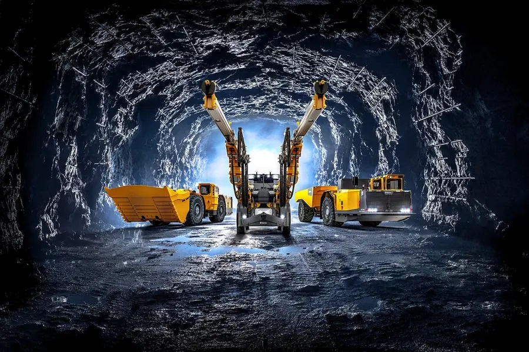
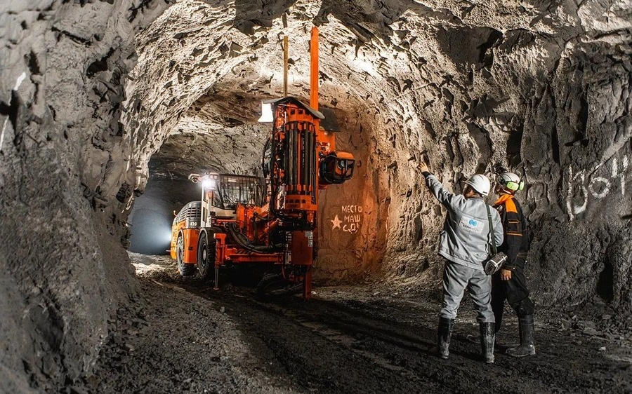

# Евгений Васендин
**Возраст:** 32 года\
**Место проживания:** пгт. Никель, Печенгский район, Мурманская область\
**Сфера деятельности:** Горнодобывающая промышленность

**Профессиональный профиль**\
Опытный взрывник с 13-летним стажем работы на руднике «Северный» (Кольская ГМК, «Норильский Никель»). Специализируюсь на организации и проведении взрывных работ в условиях Крайнего Севера. Моя работа требует безупречного знания технологий, строгого соблюдения норм безопасности и умения принимать решения в нестандартных ситуациях.

**Опыт работы:**
Компания: ПАО «ГМК «Норильский Никель», Кольская ГМК\
Рудник: «Северный»\
Должность: Взрывник\
Стаж: 13 лет (с 19 лет)

**Ключевые задачи:**

- Подготовка и проведение взрывных работ на открытых и подземных горных выработках.

- Расчет параметров зарядов, выбор оптимальных методов взрывания.

- Контроль за соблюдением экологических и промышленных стандартов безопасности.

- Взаимодействие с геологами, маркшейдерами и горными инженерами для оптимизации процессов добычи.

- Обучение молодых специалистов, передача опыта.

**Ключевые навыки**
- Проектирование и реализация взрывных операций в сложных климатических условиях (Заполярье).

- Работа с современным оборудованием и цифровыми системами контроля.

- Анализ рисков, предотвращение аварийных ситуаций.

- Знание нормативной базы (ФНиП, ГОСТ, корпоративные стандарты).

- Умение работать в команде и руководить процессами на ответственном участке.

**Достижения**
- Участие в модернизации технологий взрывных работ на руднике, что повысило эффективность добычи на 15% (2020–2023 гг.).

- Нулевой уровень аварийности на закрепленных участках за последние 13 лет.

- Внедрение методов, сокративших экологическую нагрузку при проведении работ.

**Личные качества**
- Ответственность и дисциплина — основа моей профессии.

- Адаптивность к экстремальным условиям: работа при температурах до -40°C, в условиях полярной ночи.

- Глубокое уважение к профессии и региону, где живу и работаю.

*«Моя работа — это симбиоз точной науки и практического опыта. Каждый взрыв должен быть не только эффективным, но и безопасным — для людей и природы»*

